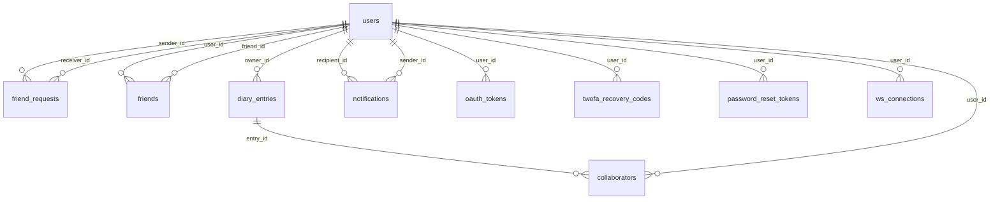

*This project has been created as part of the 42 curriculum by inkahar, aymohamm, fkuruthl, smuneer.*

<div align="center">

#  🐤 Quillow
### ft_transcendence — Quillow Diary App

**A secure, social, and collaborative diary platform**
*Built as a full-stack 42 project by a team of four.*

[](https://nodejs.org/)
[](https://react.dev/)
[](https://www.postgresql.org/)
[](https://docs.docker.com/compose/)
[](https://owasp.org/www-project-modsecurity-core-rule-set/)
[](https://www.vaultproject.io/)

</div>

---

## 📖 Description

Quillow is a secure, social, and collaborative diary platform. Users can register and log in, manage friendships, create private or collaborative diary spaces, and interact in real time.

**Key features:**

- 🔐 Secure authentication with JWT, Google OAuth, password reset, and 2FA
- 👥 Friend system with requests, acceptance/decline flows, and presence-aware collaboration rules
- 📓 Diary management with private/collaborative modes and collaborator invitations
- ⚡ Real-time updates over WebSocket (presence, collaboration, notifications)
- 🛡️ Defense-in-depth runtime: API gateway + OWASP ModSecurity WAF + Vault-backed secret loading

---

## 👥 Team

| Login | Role | Responsibilities |
|:---|:---|:---|
| `inkahar` | Backend Lead · DevOps/Security | Service orchestration, API gateway, routing architecture, WAF/Vault hardening, 3D environment integration direction |
| `aymohamm` | PO · Frontend Lead | UX/UI flows, core diary interaction screens, auth UX, user-facing validation and product alignment |
| `fkuruthl` | PM · Tech Lead (Auth-Service) | Project management, sprint planning, auth-service architecture and implementation, security hardening, documentation |
| `smuneer` | Backend Developer (Diary & Realtime) | diary-service REST API, collaboration system with role-based permissions, real-time notification integration, WebSocket trigger endpoint, socket authentication |

---

## 🗂️ Project Management

**Work organization:**
- Split by domain ownership: frontend UX, backend services, and infrastructure/security
- Features delivered in short cycles with integration checkpoints to prevent service drift
- Figma (UI wireframes, design system alignment, prototyping and user-flow planning)
- Recurring standups and merge-review checkpoints for team sync

**Tools:**
- **Jira:** [Team board & sprint tracking](https://transcnevnvnencne.atlassian.net/jira/core/projects/PM/board?filter=assignee%20IN%20(%22712020%3A72fa8ce1-4cca-4f19-8fd0-ad9e012a78ab%22%2C%20%22712020%3A3e9eeeb2-f71f-40ea-80e7-2c3e057c7e65%22%2C%20%22712020%3Acf318589-e7e2-4db0-ad4a-447d2c8f5923%22%2C%20%225ea5a337c5c6230baae0fd76%22)&groupBy=status)
- **Notion:** [Documentation, runbooks, and decision logs](https://www.notion.so/TRANSCENDENCEEE-3-2f10353c2aa781bd830dd3f011bb4d1e?p=2f10353c2aa7815dad02c296d73b55e5&pm=s)
- GitHub Issues, pull requests, branch-based workflow
- WhatsApp + in-person lab syncs at 42 Abu Dhabi

---

## 🧭 Frontend Product & UX Scope

- Planned end-to-end user flows for auth, dashboard, read mode, and edit mode
- Defined interaction states for diary tools (select/text/mic/upload/sticker), popups, and toolbars
- Maintained visual consistency using shared color, spacing, radius, and typography patterns
- Ran frontend testing for validation states, empty/error states, and responsive behavior (desktop/tablet/mobile)

 --- 

## 🛠️ Technical Stack

### Frontend
- React 19, React Router 7, Vite (`rolldown-vite`), TailwindCSS
- Three.js ecosystem: `three`, `@react-three/fiber`, `@react-three/drei`, `@react-three/rapier`

### Backend
- Node.js microservices using Fastify/Express patterns with Socket.IO for realtime transport
- `auth-service` · `diary-service` · `realtime-service` · `api-gateway`

### Database
- **PostgreSQL 16** — chosen for relational integrity, strong indexing, transactional consistency, and natural fit for user/friend/collaboration relationships
  - **Why PostgreSQL over alternatives:** MySQL lacks advanced constraint/trigger capabilities needed for collaboration rules; MongoDB's document model doesn't enforce referential integrity for friend/diary relationships; SQLite has concurrency limitations for multi-service access. PostgreSQL's ACID guarantees, constraint triggers, and JSONB support for flexible notification metadata made it the optimal choice for this collaborative application.

### Security & Platform
- OWASP ModSecurity CRS (WAF) · HashiCorp Vault (server mode, locally initialized/unsealed) · Docker Compose · OpenSSL TLS

### Key Architecture Decisions

| Decision | Justification |
|:---|:---|
| Microservice split | Isolate auth/domain/realtime concerns and keep service contracts independently deployable |
| PostgreSQL constraints/triggers | Enforce business rules at DB level, not only in API code |
| WAF + Gateway + JWT + Vault | Layered security controls for HTTP APIs, with dedicated realtime proxy handling for Socket.IO transport |

---

## 🗃️ Database Schema



**Main tables:**

| Table | Key Fields |
|:---|:---|
| `users` | `id (varchar PK)`, `username`, `email`, `password_hash`, `google_id`, `is_active`, timestamps |
| `diary_entries` | `id (text PK)`, `owner_id`, `content`, `diary_type (private/collaborative)`, `is_private` |
| `collaborators` | `id`, `entry_id`, `user_id`, `role (viewer/editor)`, `status` |
| `friend_requests` | sender/receiver relationship with constrained `status` |
| `friends` | bidirectional friendship links |
| `notifications` | persisted notifications with `jsonb` metadata and read/archive states |
| `oauth_tokens` / `password_reset_tokens` / `twofa_recovery_codes` | auth lifecycle tables |
| `ws_connections` / `active_sessions` / `activity_log` | realtime and audit tables |

> **Integrity note:** Trigger `trg_enforce_single_diary_type_per_owner` enforces one private and one collaborative diary per owner. Unique and check constraints enforce collaboration status/role and friend-request lifecycle.

---

## ✅ Features

| Feature | Functionality | Owner(s) |
|:---|:---|:---|
| Account registration/login | Standard credential auth with JWT issuance and validation | `fkuruthl`, `inkahar` |
| Google OAuth login/link | OAuth flow init/callback with account linking | `fkuruthl`, `aymohamm` |
| Two-factor authentication | 2FA enable/verify/disable, resend, recovery code regeneration | `fkuruthl`, `inkahar` |
| Password recovery | Forgot/reset password flows with token lifecycle | `fkuruthl`, `aymohamm` |
| Profile management | User profile update and avatar upload | `fkuruthl`, `aymohamm` |

| Collaboration system REST API | Invite/accept/decline/permissions management with role-based access | `smuneer`, `inkahar`, `aymohamm` |
| Notifications REST API | Pagination, unread count, mark as read, real-time delivery | `smuneer`, `inkahar`, `aymohamm` |
| Dashboard statistics | Aggregated stats for friends, entries, notifications, invites | `smuneer`, `inkahar` |
| User management REST API | Profile viewing, user search, friendship status | `smuneer`, `fkuruthl` |
| Realtime notifications/presence | Socket-driven live notifications and online state | `smuneer`, `inkahar` |
| WebSocket trigger integration | REST-to-WebSocket notification bridge for instant delivery | `smuneer`, `inkahar` |
| 3D world experience | 3D scene entrypoint, movement/interaction shell, and diary access bridge | `aymohamm`, `inkahar` |
| API gateway routing | Unified edge routing for auth/diary/realtime services | `inkahar` |
| WAF hardening | ModSecurity rules and targeted false-positive tuning | `inkahar`, `fkuruthl` |
| Vault secret loading | Runtime secret injection for services | `inkahar`, `fkuruthl` |

---

## 🏆 Modules

> **Scoring:** Major = 2 pts · Minor = 1 pt · **Total: 19 pts**

### Module Selection Rationale

| Category | Decision |
|:---|:---|
| **Framework (Major, 2pts)** | React + Fastify/Express are industry-standard for scalable web applications with strong ecosystem support and active community |
| **WebSockets (Major, 2pts)** | Real-time collaboration and notifications are core to the diary app's value; Socket.IO provides proven WebSocket abstraction with fallback support |
| **Notification System (Minor, 1pt)** | Crucial for user engagement in real-time collaborative features; paginated API + WebSocket delivery provide both persistence and instant updates |
| **Real-time Collaboration (Minor, 1pt)** | Distinguishes the product by enabling live co-authoring and presence awareness; implemented via Socket.IO rooms and permission guards |
| **Standard Auth (Major, 2pts)** | JWT + password-based authentication is industry standard and baseline for any multi-user SaaS |
| **OAuth 2.0 (Minor, 1pt)** | Reduces user friction with single-sign-on while delegating credential management to trusted provider (Google) |
| **2FA System (Minor, 1pt)** | Elevates security posture for user accounts; essential given sensitive nature of diary data |
| **Voice Integration (Minor, 1pt)** | Differentiates UX by allowing voice-based diary entries in 3D world; engaging alternative to text-only input |
| **WAF + Vault (Major, 2pts)** | Defense-in-depth security approach: WAF blocks network attacks (SQL injection, XSS); Vault centralizes secret management per 42 curriculum expectations |
| **3D Graphics (Major, 2pts)** | Three.js ecosystem enables immersive diary interaction in a virtual space; aligns with 42 transcendence theme |
| **Microservices (Major, 2pts)** | Separates concerns (auth/diary/realtime), enables parallel team development, improves scalability and maintainability |

### Module Implementation Details

| Category | Module | Type | Pts | Owner(s) | Implementation |
|:---|:---|:---:|:---:|:---|:---|
| Web | Framework for frontend and backend | Major | 2 | All team | React 19 + Vite for frontend; Fastify/Express patterns for backend microservices; unified Node.js runtime |
| Web | Real-time features via WebSockets | Major | 2 | `smuneer`, `inkahar` | Socket.IO with rooms, custom event handlers, and authenticated WebSocket proxy at API gateway |
| Web | User-to-user interaction | Major | 2 | `smuneer`, `aymohamm` | Friend request/acceptance/decline REST API, collaborator invitations, presence-aware messaging |
| Web | Complete notification system | Minor | 1 | `smuneer`, `inkahar` | Persistent PostgreSQL table, REST pagination, real-time WebSocket delivery, unread count tracking |
| Web | Real-time collaborative features | Minor | 1 | `smuneer`, `inkahar`, `aymohamm` | Socket.IO rooms for diary sessions, role-based permission checks, live presence for active editors |
| User Management | Standard auth and user management | Major | 2 | `fkuruthl`, `inkahar`, `aymohamm` | JWT token issuance, Bcrypt password hashing, user profile endpoints, session management |
| User Management | Remote authentication (OAuth 2.0) | Minor | 1 | `fkuruthl`, `aymohamm` | Google OAuth flow integration, account linking, token refresh lifecycle |
| User Management | 2FA system | Minor | 1 | `fkuruthl`, | Email-based OTP codes, recovery codes, 2-minute expiry, resend functionality |
| Artificial Intelligence | Voice/speech integration | Minor | 1 | `aymohamm` | Browser Speech-to-Text API integration for voice diary entries in 3D world |
| Cybersecurity | WAF/ModSecurity + HashiCorp Vault | Major | 2 | `inkahar` | OWASP ModSecurity CRS at Nginx, route-level rule tuning, Vault server-mode secret injection |
| Gaming and UX | Advanced 3D graphics (Three.js) | Major | 2 | `aymohamm`, `inkahar` | Three.js scene with @react-three/fiber, physics via @react-three/rapier, interactive diary access portal |
| DevOps | Backend as microservices | Major | 2 | `inkahar` | Four independent services (auth/diary/realtime/gateway), Docker Compose orchestration, service discovery via internal DNS |

---

## 👤 Individual Contributions

<details>
<summary><strong>🔧 inkahar</strong> — PM · Backend Lead · DevOps/Security</summary>

<br>

#### 🗺️ Ownership Scope

| Area | Responsibility |
|:---|:---|
| 🏗️ Microservices architecture | Service boundaries and domain ownership model |
| 🔀 API Gateway | Edge-layer routing and inter-service request flow |
| 🛡️ WAF hardening | OWASP ModSecurity CRS integration and tuning |
| 🔑 Vault secrets | Runtime secret lifecycle and seed workflow |
| 🌐 3D environment | Integration support for Three.js app flows |

#### 🧰 Stack

**Platform & Runtime**
- Node.js `22.22.0` · Docker + Docker Compose · PostgreSQL 16
- Make-based orchestration: `make` · `make up` · `make vault-seed` · `make down`

**Microservices & Routing**
- `api-gateway` — central edge router/proxy
- `auth-service` · `diary-service` · `realtime-service`
- HTTP proxy forwarding with dual prefixes (`/auth` + `/api/auth`, `/diary` + `/api/diary`) for compatibility
- WebSocket proxy support at gateway (`/socket.io`, `/api/socket.io`) with upgrade handling
- JWT-protected route forwarding and auth-aware gateway flows

**Security & Hardening**
- OWASP ModSecurity CRS (WAF) with route-level false-positive tuning
- WAF routing profile:
  - `/socket.io` proxied directly to realtime-service with WS upgrade support
  - `/diary/api/entries` keeps WAF enabled with tuned body limit/rule suppressions for rich diary payloads
  - `/auth/google/*` explicitly bypassed to avoid OAuth flow breakage
- TLS local certificate setup via OpenSSL
- Defense-in-depth path:
```
WAF (HTTP)  →  Gateway  →  Service JWT/Auth  →  DB constraints
WAF (Socket.IO)  →  realtime-service
```

**Secret Management**
- HashiCorp Vault server mode (not `-dev`) with local init/unseal flow (`key-shares=3`, `key-threshold=3`)
- Policy-based app token generation and token-file injection (`VAULT_TOKEN_FILE=/vault/shared/app-token`)
- Vault KV v2 seed flow from `.env` and runtime override loading (`VAULT_OVERRIDE=true`)
- Managed keys: `JWT_SECRET` · `VAULT_ADDR` · `VAULT_TOKEN_FILE` · `VAULT_KV_PATHS` · OAuth/email secrets

**Realtime / Infra Integration**
- Cross-service Socket.IO delivery path support
- Container networking and orchestration across all services
- REST-to-realtime trigger pipeline support at architecture level

**Frontend 3D Contribution**
- React + Vite integration path for 3D access flow
- `@react-three/fiber` · `@react-three/drei` · `@react-three/rapier`

#### 📦 Technical Deliverables

- Defined service split and inter-service communication model
- Implemented unified API gateway routing map for auth/domain/realtime traffic
- Enforced layered security at edge and runtime with WAF + Vault
- Reduced WAF false positives without weakening required protections
- Stabilized local infra boot sequence and service dependency wiring
- Contributed to 3D environment integration in product UX flow

#### ⚡ Engineering Challenges Solved

> **WAF tuning vs. collaborative payloads** — ModSecurity CRS rules are aggressive by design, but rich-text diary content with nested JSON triggered false positives. Solution: route-level tuning to preserve broad WAF coverage while carving surgical exceptions only where app payloads genuinely differed from attack signatures.

- Kept gateway routing deterministic while multiple services evolved in parallel
- Prevented secret sprawl by centralizing sensitive config in Vault
- Integrated security controls without blocking development velocity

</details>

---

<details>
<summary><strong>🎨 aymohamm</strong> — PO · Frontend Lead </summary>

<br>

- Developed core frontend flows: auth screens, 3D world entry, flipbook/diary-facing UI paths
- Implemented user-facing friend/collaboration interactions and form validation behavior
- Contributed to diary and auth service integration from UI to API
- Led frontend validation and usability testing (desktop/tablet/mobile), including auth edge cases and editor interaction checks
- **Challenge:** Preserving UX consistency while supporting both standard and collaborative diary modes

</details>

---

<details>
<summary><strong>🔐 fkuruthl</strong> — PM · Tech Lead (Auth-Service) </summary>

<br>

#### 🗺️ Ownership Scope

| Area | Responsibility |
|:---|:---|
| 📋 Project Management | Sprint planning, task tracking, team coordination, backlog management, roadmap alignment |
| 🏗️ Auth-Service Architecture | Full ownership of auth microservice design, endpoints, and security controls |
| 🔐 Auth Security | Rate limiting, password policy, 2FA implementation, JWT lifecycle |
| 🔑 Password Management | Bcrypt hashing + salting, password reset flows, policy validation |
| 📧 2FA System | Code generation, expiry, recovery codes, email delivery |
| 👤 User Management | User profile endpoints, user search, account management |
| 🛡️ Security Hardening | Input validation, error handling, duplicate detection, security headers |
| 📚 Documentation | README, technical guides, validation reports, API documentation |

#### 🧰 Stack & Implementations

**Project Management**
- Sprint planning, task breakdown, and team coordination using **Jira** for issue tracking and sprint boards
- **Notion** for documentation, runbooks, and knowledge base management
- Backlog prioritization and roadmap planning
- Regular standup facilitation and blockers tracking
- Cross-functional team synchronization across auth, backend, and frontend domains
- Sprint retrospectives and process improvement tracking

**Auth-Service Implementation**
- Complete microservice architecture: controllers, routes, middleware, utilities
- Database schema design for users, OAuth tokens, 2FA recovery codes, password reset tokens
- Express/Fastify integration patterns with proper error handling and validation
- Bcrypt integration with secure password hashing and comparison
- Email service integration for password reset and 2FA code delivery
- Middleware stack for request validation, rate limiting, and authentication
- JWT token generation and secret management via Vault integration

**Auth Security & Rate Limiting**
- In-memory rate limiter for auth endpoints:
  - `registerLimiter`: 5 registrations per 15 minutes
  - `authLimiter`: 10 login attempts per 15 minutes
  - `passwordResetLimiter`: 5 reset attempts per 30 minutes
- Returns HTTP 429 with `retryAfter` header when exceeded
- IP-based tracking with automatic window cleanup

**Password Security**
- `bcryptjs` with 10-round salting (industry standard)
- Password policy validation (8+ chars, uppercase, lowercase, number, special char)
- Frontend + backend validation (defense in depth)
- Passwords hashed before DB storage, never logged or exposed

**2FA Implementation**
- Email-based OTP codes with 2-minute expiry
- Recovery codes (8 per user) for account recovery
- Bcrypt hashing for secure code storage
- One-time use enforcement via `used_at` timestamp tracking
- Resend functionality with rate limiting

**Error Handling & Input Validation**
- Case-insensitive email handling (prevents duplicate case variants)
- Specific error messages for duplicate email/username (409 conflict)
- Generic "Invalid email or password" on auth failure (prevents user enumeration)
- Proper HTTP status codes: 400 (bad input), 401 (auth failure), 409 (conflict), 429 (rate limit)

#### 📦 Technical Deliverables

- **Project Management:**
  - Jira sprint board setup and issue lifecycle management (backlog → todo → in-progress → review → done)
  - Notion workspace with runbooks, decision logs, and technical documentation
  - Sprint retrospectives and process improvements
  - Stakeholder communication and progress tracking
  - End-to-end project tracking across all four team members and three services
  
- **Auth-Service Architecture & Implementation:**
  - Designed and implemented complete auth microservice with controllers, routes, middleware
  - Built database schema for user accounts, OAuth tokens, 2FA codes, and password resets
  - Integrated Bcrypt for secure password hashing with configurable salt rounds
  - Implemented rate limiting across all auth endpoints with sliding window algorithm
  - Configured password policy validation (8+ chars, uppercase, lowercase, number, special char)
  - Built complete 2FA lifecycle: enable → verify → disable + recovery codes
  - Implemented secure password reset with token expiry and email validation
  - Created duplicate user detection with specific error differentiation (email vs username)
  - Integrated email service for 2FA and password reset notifications
  - Coordinated auth service integration with gateway, Vault, and frontend flows

---

<details>
<summary><strong>⚙️ smuneer</strong> — Backend Developer (Diary & Realtime Services)</summary>

<br>

- **Friends management:** Send/accept/decline friend requests, online status integration, bidirectional friendship creation, real-time notifications on all friendship actions
- **Collaboration system:** Role-based permissions (viewer/editor), invite/accept/decline flows, collaborator management, permission updates, online status for active collaborators, comprehensive access control
- **Notifications management:** Pagination, unread count, mark as read, mark all as read, delete notifications
- **Dashboard statistics:** Aggregated counts for friends, online friends, notifications, entries, pending invites
- Implemented notification service bridging REST API to WebSocket for real-time delivery across all friendship and collaboration actions
- Built WebSocket authentication middleware and trigger endpoint in `realtime-service` for REST-to-WebSocket integration
- **Challenge:** Implementing complex collaboration permissions with real-time notification triggers while maintaining data consistency across microservices — ensuring proper access control for shared diary entries and a seamless REST-to-WebSocket bridge without message loss or race conditions

</details>

---

## 🚀 Instructions

### Prerequisites

| Requirement | Notes |
|:---|:---|
| Docker Engine + Compose plugin | Any modern OS |
| Node.js `22.22.0` | See `.nvmrc` |
| `openssl` | For local TLS cert generation |
| `lsof` | Used by `make dev` port check |

### Configuration (`.env`)

1. Ensure `.env` exists at the repository root
2. Configure required keys:

```env
# PostgreSQL
POSTGRES_USER=...
POSTGRES_PASSWORD=...
POSTGRES_DB=...

# Auth / Security
JWT_SECRET=...
VAULT_ADDR=...
VAULT_TOKEN=...
VAULT_KV_PATHS=...

# OAuth / Email
GOOGLE_CLIENT_ID=...
GOOGLE_CLIENT_SECRET=...
GOOGLE_REDIRECT_URI=...
EMAIL_HOST=...
```

> ⚠️ **Never commit real production secrets.**

### Run (recommended)

```bash
make
```

This runs: dependency install → Docker build/up → Vault seed → frontend dev server on `:5173`

### Manual run

```bash
# 1. Start backend stack
make up

# 2. Seed Vault
make vault-seed

# 3. Start frontend
cd frontend && npm run dev
```

### Access Points

| Service | URL |
|:---|:---|
| Frontend | `https://localhost:5173` |
| API Gateway | `http://localhost:8080` |
| WAF HTTPS entry | `https://localhost:8081` |
| Vault UI/API | `http://localhost:8200` |

### Stop & Clean

```bash
make down      # stop services
make fclean    # full clean — also removes generated certs
```

---

## 📚 Resources

**Classic references:**
- 42 ft_transcendence subject and campus correction guides
- PostgreSQL docs: schema design, indexes, constraints, triggers
- Fastify and Express official docs
- Figma workspace (design boards, component specs, interaction prototypes)
- Socket.IO docs: auth middleware, rooms, events
- OWASP ModSecurity CRS docs
- HashiCorp Vault docs (server mode, init/unseal, policy/token, KV v2)
- React, React Router, Vite, Three.js / React Three Fiber docs

**AI usage in this project:**
- Used to help draft documentation structure, consistency checks, and wording improvements
- Used for technical summarization and cross-checking README sections against code layout
- AI was not used as a replacement for implementation ownership — code decisions and integration were made and validated by the team

---

## ⚠️ Known Limitations

- Vault is not running with `-dev`; it runs in server mode, but still has local-only constraints (single-node file storage, local init material, and HTTP listener without TLS inside Docker network)
- WAF tuning is optimized for this app's payload profile and may require recalibration if the API changes

---

</div>
