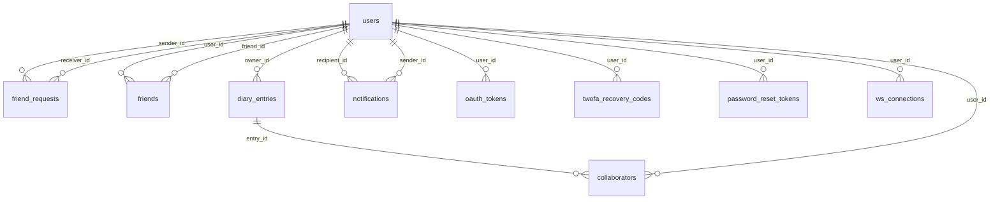

This project has been created as part of the 42 curriculum by inaidikai, aymohamm, fkuruthl, smuneer.

# Quillow - ft_transcendence (Surprise)

## Description
Quillow is a secure, social, and collaborative diary platform built as a full-stack 42 project.  
The goal is to provide a modern web application where users can register/login, manage friendships, create private or collaborative diary spaces, and interact in real time.

Key features:
- Secure authentication with JWT, Google OAuth, password reset, and 2FA.
- Friend system with requests, acceptance/decline flows, and presence-aware collaboration rules.
- Diary management with private/collaborative modes and collaborator invitations.
- Real-time updates over WebSocket (presence, collaboration, notifications).
- Defense-in-depth runtime with API gateway, OWASP ModSecurity WAF, and Vault-backed secret loading.

## Team Information
| Login | Assigned role(s) | Responsibilities |
|---|---|---|
| inaidikai | PM, Backend Lead, DevOps/Security | Service orchestration, API gateway, realtime architecture, infra hardening, integration direction. |
| aymohamm | PO, Frontend Lead, Full-stack Developer | UX/UI flows, core diary interaction screens, auth UX, user-facing validation and product alignment. |
| fkuruthl | Tech Lead (Auth/Integration), Full-stack Developer | Auth service integration, profile flows, testing support, cross-service coordination and documentation. |
| `smuneer` | Backend Developer (Diary & Realtime Services) | diary-service REST API implementation, collaboration system with role-based permissions, real-time notification integration, WebSocket trigger endpoint, and socket authentication. |

## Project Management
Work organization:
- Work was split by domain ownership: frontend UX, backend services, and infrastructure/security.
- Features were delivered in short cycles with integration checkpoints to prevent drift between services.
- Team syncs were done through recurring standups and merge-review checkpoints.

Tools and channels:
- Project management tools: GitHub Issues, pull requests, branch-based workflow.
- Communication channels: WhatsApp, in-person lab syncs at 42 Abu Dhabi.

## Technical Stack
Frontend:
- React 19, React Router 7, Vite (`rolldown-vite`), TailwindCSS, Three.js ecosystem (`@react-three/fiber`, `@react-three/drei`, `@react-three/rapier`).

Backend:
- Node.js microservices using Fastify and Express.
- `auth-service` for auth/identity, `diary-service` for diary/social domain, `realtime-service` for Socket.IO events, `api-gateway` for routing/proxy.

Database:
- PostgreSQL 16.
- Chosen for relational integrity, strong indexing, transactional consistency, and good fit for user/friend/collaboration relationships.

Security and platform:
- OWASP ModSecurity CRS (WAF), HashiCorp Vault (dev mode for secrets), Docker Compose, OpenSSL local TLS cert generation.

Major technical choices and justification:
- Microservice split to isolate auth, domain logic, realtime traffic, and gateway concerns.
- PostgreSQL schema constraints/triggers to enforce business rules at DB level (not only in API code).
- WAF + gateway + JWT + Vault to create layered security controls.

## Database Schema
Visual overview:



Main tables and key fields:
- `users`: `id (varchar PK)`, `username`, `email`, `password_hash`, `google_id`, `is_active`, timestamps.
- `diary_entries`: `id (text PK)`, `owner_id`, `content`, `diary_type (private/collaborative)`, `is_private`.
- `collaborators`: `id`, `entry_id`, `user_id`, `role (viewer/editor)`, `status`.
- `friend_requests`: sender/receiver relationship with constrained `status`.
- `friends`: bidirectional friendship links.
- `notifications`: persisted notifications with metadata (`jsonb`) and read/archive states.
- `oauth_tokens`, `oauth_states`, `password_reset_tokens`, `twofa_recovery_codes`.
- `ws_connections`, `active_sessions`, `activity_log`.

Relationship and integrity notes:
- Unique and check constraints enforce collaboration status/role and friend-request lifecycle.
- Trigger `trg_enforce_single_diary_type_per_owner` enforces one private and one collaborative diary per owner.

## Features List
| Feature | Functionality | Team member(s) |
|---|---|---|
| Account registration/login | Standard credential auth with JWT issuance and validation | `inaidikai`, `fkuruthl` |
| Google OAuth login/link | OAuth flow init/callback with account linking | `inaidikai`, `aymohamm` |
| Two-factor authentication | 2FA enable/verify/disable, resend, recovery code regeneration | `fkuruthl`, `inaidikai` |
| Password recovery | Forgot/reset password flows with token lifecycle | `fkuruthl`, `aymohamm` |
| Profile management | User profile update and avatar upload | `fkuruthl`, `aymohamm` |
| Friends system REST API | Complete friend request CRUD with online status integration | `smuneer`, `aymohamm` |
| Diary entries REST API | Full CRUD with access control, privacy settings, and sharing | `smuneer`, `aymohamm` |
| Collaboration system REST API | Invite/accept/decline/permissions management with role-based access | `smuneer`, `inaidikai`, `aymohamm` |
| Notifications REST API | Pagination, unread count, mark as read, real-time delivery | `smuneer`, `inaidikai` , `aymohamm` |
| Dashboard statistics | Aggregated stats for friends, entries, notifications, invites | `smuneer`, `inaidikai` |
| User management REST API | Profile viewing, user search, friendship status | `smuneer`, `fkuruthl` |
| Realtime notifications/presence | Socket-driven live notifications and online state | `smuneer`, `inaidikai` |
| WebSocket trigger integration | REST-to-WebSocket notification bridge for instant delivery | `smuneer`, `inaidikai` |
| 3D world experience | 3D scene entrypoint and interaction shell for diary access | `aymohamm` |
| API gateway routing | Unified edge routing for auth/diary/realtime services | `inaidikai` |
| WAF hardening | ModSecurity rules and targeted false-positive tuning | `inaidikai`, `fkuruthl` |
| Vault secret loading | Runtime secret injection for services | `inaidikai`, `fkuruthl` |
## Modules
Scoring rule:
- Major module = 2 pts
- Minor module = 1 pt

| Module Category | Module Name | Type | Points | Team Member(s) |
|---|---|---|---:|---|
| **Web** | Use a framework for both frontend and backend | Major | 2 | All team |
| **Web** | Implement real-time features using WebSockets | Major | 2 | `smuneer`, `inaidikai` |
| **Web** | Allow users to interact with other users | Major | 2 | `smuneer`, `aymohamm` |
| **Web** | Complete notification system | Minor | 1 | `smuneer`, `inaidikai` |
| **Web** | Real-time collaborative features | Minor | 1 | `smuneer`, `inaidikai`', `aymohamm` |
| **User Management** | Standard user management and authentication | Major | 2 | `fkuruthl`, `inaidikai`, `aymohamm` |
| **User Management** | Implement remote authentication (OAuth 2.0) | Minor | 1 | `inaidikai`, `fkuruthl` |
| **User Management** | Implement 2FA system | Minor | 1 | `fkuruthl`, `inaidikai` |
| **Artificial Intelligence** | Voice/speech integration for accessibility or interaction. | Minor | 1 | `aymohamm` |
| **Cybersecurity** | WAF/ModSecurity + HashiCorp Vault | Major | 2 | `inaidikai`, `fkuruthl` |
| **Gaming and UX** | Advanced 3D graphics (Three.js) | Major | 2 | `aymohamm` |
| **DevOps** | Backend as microservices | Major | 2 | `inaidikai` |

**Total Points: 19**

## Individual Contributions
inaidikai:
- Built and integrated api-gateway proxy paths for auth/diary/realtime.
- Implemented major realtime infrastructure and socket authentication flow.
- Led infrastructure composition (docker-compose, service networking, Vault integration).
- Added/maintained WAF behavior and security routing exceptions for valid app traffic.
- Challenge handled: balancing strict security rules with collaborative editor payloads by route-level ModSecurity tuning.

aymohamm:
- Developed core frontend flows (auth screens, 3D world entry, flipbook/diary-facing UI paths).
- Implemented user-facing friend/collaboration interactions and form validation behavior.
- Contributed to diary and auth service integration from UI to API.
- Challenge handled: preserving UX consistency while supporting both standard and collaborative diary modes.

fkuruthl:
- Contributed to auth and profile management flows, including integration and validation paths.
- Supported infra/security integration (Vault/WAF touchpoints) and service interoperability.
- Consolidated project documentation requirements and technical explanation assets.
- Challenge handled: aligning auth/security behavior across multiple services while keeping local development setup reproducible.

smuneer:
  - Friends management: Send/accept/decline friend requests, online status integration, bidirectional friendship creation, real-time notifications on all friendship actions.
  - Diary entries CRUD: Create/read/update/delete with privacy controls, access control enforcement, sharing management, collaborator count aggregation.
  - Collaboration system*: Role-based permissions (viewer/editor), invite/accept/decline flows, collaborator management, permission updates, online status for active collaborators, comprehensive access control.
  - Notifications management: Pagination, unread count, mark as read, mark all as read, delete notifications.
  - Dashboard statistics: Aggregated counts for friends, online friends, notifications, entries, pending invites.
- Implemented notification service that bridges REST API to WebSocket for real-time delivery, enabling instant notifications across all friendship and collaboration actions.
- Built WebSocket authentication middleware and trigger endpoint in realtime-service for REST-to-WebSocket integration.
- Challenge handled: Implementing complex collaboration permissions with real-time notification triggers while maintaining data consistency across microservices, ensuring proper access control for shared diary entries, and creating a seamless bridge between REST API actions and WebSocket real-time delivery without message loss or race conditions.
## Instructions
### Prerequisites
- OS with Docker Engine + Docker Compose plugin.
- Node.js `22.22.0` (from `.nvmrc`) and npm.
- `openssl` (for local TLS cert generation).
- `lsof` (used by `make dev` port check on many Unix systems).

### Configuration (`.env`)
1. Ensure `.env` exists at repository root.
2. Configure required keys used by services:
   - Postgres: `POSTGRES_USER`, `POSTGRES_PASSWORD`, `POSTGRES_DB`, `PG*`.
   - Auth/security: `JWT_SECRET`, `VAULT_ADDR`, `VAULT_TOKEN`, `VAULT_KV_PATHS`.
   - OAuth/email: `GOOGLE_CLIENT_ID`, `GOOGLE_CLIENT_SECRET`, `GOOGLE_REDIRECT_URI`, `EMAIL_*`.
3. For safety, never commit real production secrets.

### Run (recommended)
1. Install and start everything:
   ```bash
   make
   ```
2. This sequence runs:
   - dependency install across workspaces,
   - Docker services build/up,
   - Vault seed from `.env`,
   - frontend dev server on port `5173`.

### Manual run (alternative)
1. Start backend stack:
   ```bash
   make up
   ```
2. Seed Vault:
   ```bash
   make vault-seed
   ```
3. Start frontend:
   ```bash
   cd frontend && npm run dev
   ```

### Access points
- Frontend: `https://localhost:5173`
- API Gateway: `http://localhost:8080`
- WAF HTTPS entry: `https://localhost:8081`
- Vault UI/API (dev): `http://localhost:8200`


### Stop and clean
- Stop services:
  ```bash
  make down
  ```
- Full clean (also removes generated certs):
  ```bash
  make fclean
  ```

## Resources
Classic references:
- 42 ft_transcendence subject and campus correction guides.
- PostgreSQL documentation: schema design, indexes, constraints, triggers.
- Fastify and Express official docs.
- Socket.IO documentation (auth middleware, rooms, events).
- OWASP ModSecurity CRS docs.
- HashiCorp Vault docs (dev mode and KV usage).
- React, React Router, Vite, Three.js / React Three Fiber docs.

AI usage in this project:
- Used AI to help draft documentation structure, consistency checks, and wording improvements.
- Used AI for technical summarization of architecture and to cross-check that README sections match code layout.
- AI was not used as a direct replacement for implementation ownership; code decisions and integration were made and validated by the team.

## Known Limitations
- Current Vault setup is development mode only (`-dev`), not production-grade.
- Local `.env` may include sensitive values; rotate and externalize for any shared or production environment.
- WAF tuning is optimized for this app payload profile and may require recalibration if API’s changes.